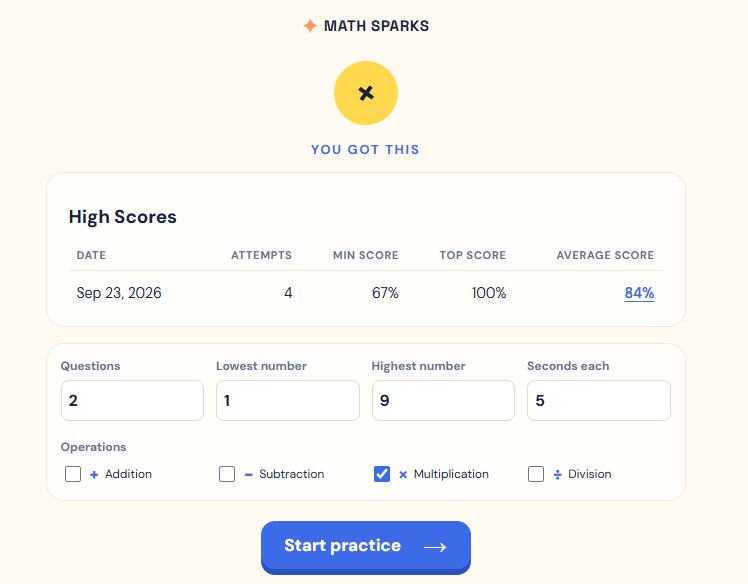
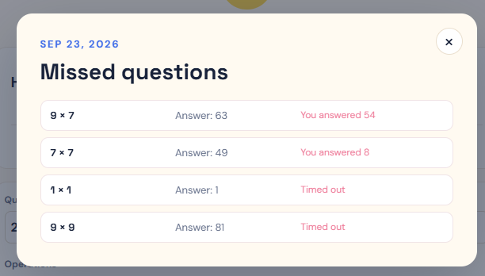

# Basic tool for Math Fluency

Help students practice match fluency without killing trees. 

- Keeps log of the last 7 days high, low, average, and attempts. 
- Records which questions were wrong or timed out.
- Configurable type, range, and time limit


Made with React/TypeScript/Vite

## Set up and run

Install Node.js 18 or newer, then install the project dependencies:

```bash
npm install
```

Start the local development server:

```bash
npm run dev
```

Open the local URL shown by Vite, usually `http://localhost:5173/`.

## Build for production

Create the production files in the `dist` directory:

```bash
npm run build
```

To preview the production build locally:

```bash
npm run preview
```

For a static web server such as Synology Web Station, upload the contents of `dist` to the site document root. The document root should contain `index.html` and the `assets` directory. No Node.js server is required to host the built files.

## Screenshots






